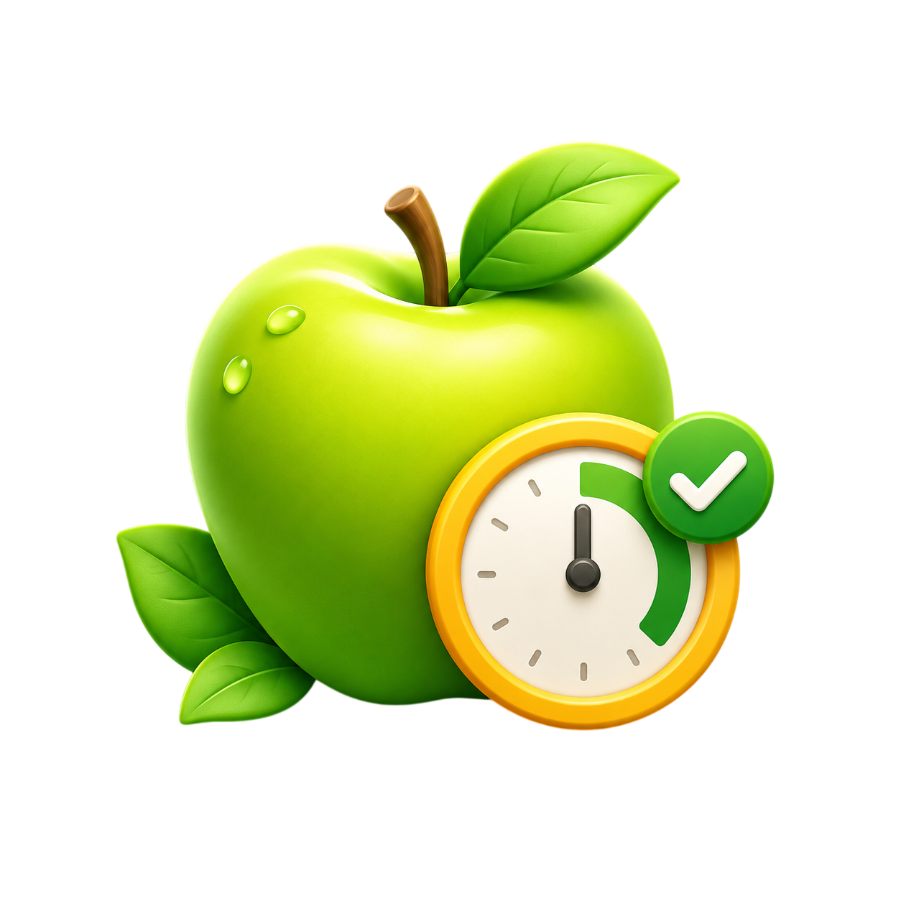

<div align="center">



# FreshUp

**Приложение для отслеживания сроков годности продуктов**

Kotlin · Jetpack Compose · Material 3 · Room

</div>

---

## 📖 О проекте

FreshUp помогает не забывать о продуктах в холодильнике, морозилке или шкафу и вовремя их использовать, пока срок годности не истёк. Добавляйте продукты вручную или сканируйте штрихкод — приложение покажет, сколько дней осталось, отсортирует по свежести и напомнит уведомлением заранее.

## ✨ Возможности

- **Учёт продуктов** — название, категория, фото, место хранения (холодильник / морозилка / шкаф)
- **Сканер штрихкодов** — сканирование через камеру на базе ML Kit Barcode Scanning + CameraX
- **Напоминания** — push-уведомления за настраиваемое число дней до конца срока (AlarmManager + WorkManager, повтор после перезагрузки устройства)
- **Статусы продуктов** — активный, просрочен, израсходован; архив с историей
- **Сводка и статистика** — дашборд и статистика по категориям и местам хранения
- **10 предустановленных категорий** — молочные продукты, мясо, рыба, овощи, фрукты и др.

## 🛠 Технологии

| Слой | Решение |
|---|---|
| Язык | Kotlin, Coroutines + Flow |
| UI | Jetpack Compose (BOM 2024.12.01), Material 3, MVVM |
| Данные | Room, DataStore Preferences |
| Камера / штрихкоды | CameraX, ML Kit Barcode Scanning |
| Изображения | Coil |
| Уведомления | WorkManager, AlarmManager |
| Сборка | Gradle Kotlin DSL, KSP, AGP 8.7.3 |

## 🚀 Сборка и запуск

**Требования:** Android Studio, JDK 17, Android SDK 35.

```bash
# Клонировать репозиторий
git clone https://github.com/<ваш-логин>/FreshUp.git
cd FreshUp

# Собрать debug-APK (появится в apk/app-debug.apk)
./gradlew assembleDebug
```

Или откройте проект в Android Studio: **File → Open** → выберите папку проекта → **Run** ▶.

- Минимальная версия Android: **8.0 (API 26)**
- Целевая версия: **Android 15 (API 35)**

## 📁 Структура проекта

```
app/src/main/java/com/example/freshup/
├── data/            # Room, репозитории, DataStore, фото, штрихкоды
│   ├── database/    #   ProductEntity, ProductDao, AppDatabase
│   └── repository/  #   ProductRepositoryImpl
├── domain/
│   ├── model/       #   Product, Category, StorageLocation, ProductStatus
│   └── repository/ #   ProductRepository (интерфейс)
├── notification/    # Уведомления, планировщики, BootReceiver
├── presentation/
│   ├── main/        #   Список продуктов, ViewModel, компоненты
│   └── settings/    #   Экран настроек
└── ui/theme/        #   Тема Material 3
```

## 📄 Лицензия

Проект распространяется по лицензии [GNU GPL-3.0](LICENSE).
